```python
import icon_registration
```


```python
import icon_registration as icon
import icon_registration.data
import icon_registration.networks as networks
from icon_registration.config import device

import numpy as np
import torch
import torchvision.utils
import matplotlib.pyplot as plt
```


```python
ds, _ = icon_registration.data.get_dataset_mnist(split="train", number=5)

sample_batch = next(iter(ds))[0]
plt.imshow(torchvision.utils.make_grid(sample_batch[:12], nrow=4)[0])
```


    <matplotlib.image.AxesImage at 0x7fe1bc0cf430>


    
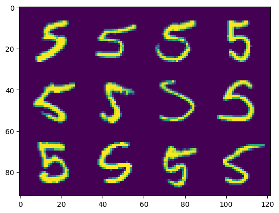
    


```python

```


```python

```


```python

```


```python
import multiscale_constr_model
```


```python

```


```python
inner_net = icon.FunctionFromVectorField(networks.tallUNet2(dimension=2))

for _ in range(3):
     inner_net = icon.TwoStepRegistration(
         icon.DownsampleRegistration(inner_net, dimension=2),
         icon.FunctionFromVectorField(networks.tallUNet2(dimension=2))
     )

teacher_net = icon.GradientICON(inner_net, icon.LNCC(sigma=4), lmbda=.5)

teacher_net.assign_identity_map(sample_batch.shape)
teacher_net.train()
teacher_net.to(device)

optim = torch.optim.Adam(teacher_net.parameters(), lr=0.001)
curves = icon.train_datasets(teacher_net, optim, ds, ds, epochs=5)
plt.close()
plt.plot(np.array(curves)[:, :3])
```

    100%|███████████████████████████████████████████████████████████████████████████████████████████████████████████████████| 5/5 [00:48<00:00,  9.64s/it]


    [<matplotlib.lines.Line2D at 0x7fe1b2f735b0>,
     <matplotlib.lines.Line2D at 0x7fe1b2f73610>,
     <matplotlib.lines.Line2D at 0x7fe1b2f73640>]


    
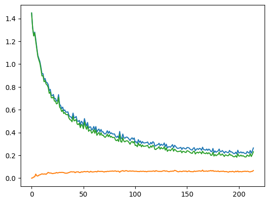
    


```python

```


```python

```


```python
import unet
import importlib
importlib.reload(unet)
unet = unet.GenericUNet(input_channels=1, output_channels=64, init_zero=False, regis_scale=False)
unet.cuda()
image_A = sample_batch.cuda()
ufeatures = unet(image_A)
```


```python
class AttentionRegistration(icon_registration.RegistrationModule):
    def __init__(self, net):
        super().__init__()
        self.net = net
        dim = 64
        
        self.blur_kernel = torch.nn.Conv2d(2, 2, 5, padding="same", bias=False, groups=2)
    
    def featurize(self, values):
        return self.net(values)
        return self.net(torch.cat([
            0* self.identity_map.expand(values.shape[0], -1, values.shape[2], values.shape[3]),
            values], dim=1))
    
    def forward(self, A, B):
        ft_A = self.featurize(A)
        ft_B = self.featurize(B)
        
        ft_A = ft_A.reshape(-1, 64, self.identity_map.shape[-1] * self.identity_map.shape[-2])
        ft_B = ft_B.reshape(-1, 64, self.identity_map.shape[-1] * self.identity_map.shape[-2])

        
        attention = torch.nn.functional.softmax((ft_B.permute(0, 2, 1) @ ft_A), dim=2)
        
        self.attention = attention
        
        
        x = self.identity_map.reshape(-1, 2, ft_A.shape[2])
        
        output = attention @ x.permute(0, 2, 1)
        
        output = output.reshape(-1, 2, self.identity_map.shape[2], self.identity_map.shape[3]) - self.identity_map
        #output = self.blur_kernel(output)
        
        return output
ar = AttentionRegistration(unet)
ar.cuda()
0
```


    0


```python
inner_net = icon.FunctionFromVectorField(ar)
inner_net.assign_identity_map(sample_batch.shape)
inner_net.cuda()
0
```


    0


```python
import tqdm
optimizer = torch.optim.Adam(unet.parameters(), lr=0.001)
epochs = 34
loss_history  = []
for epoch in tqdm.tqdm(range(epochs)):
    for A, B in zip(ds, ds):
        image_A = A[0].to(icon_registration.config.device)
        image_B = B[0].to(icon_registration.config.device)

        optimizer.zero_grad()

        teacher_phi = teacher_net.regis_net(image_A, image_B)(teacher_net.identity_map).detach()
        student_phi = inner_net(image_A, image_B)(teacher_net.identity_map)
        
        error = torch.mean((student_phi - teacher_phi)**2)
        
        error.backward()
        optimizer.step()

        loss_history.append(error.detach().item())
plt.plot(loss_history)

```

    100%|█████████████████████████████████████████████████████████████████████████████████████████████████████████████████| 34/34 [02:05<00:00,  3.70s/it]


    [<matplotlib.lines.Line2D at 0x7fe190d6d940>]


    
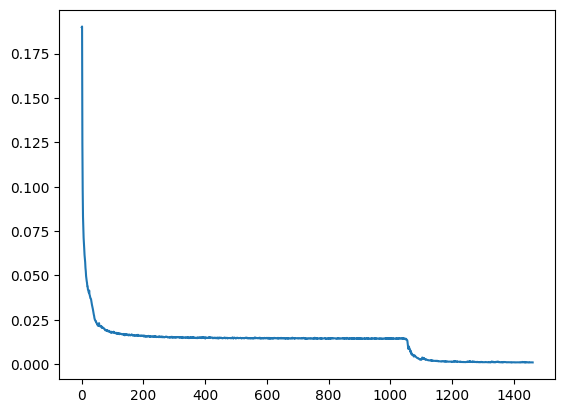
    


```python


net = icon.GradientICON(inner_net, icon.LNCC(sigma=4), lmbda=.5)
net.assign_identity_map(sample_batch.shape)
net.cuda()
```


    GradientICON(
      (regis_net): FunctionFromVectorField(
        (net): AttentionRegistration(
          (net): GenericUNet(
            (downConvs): ModuleList(
              (0): Conv2d(1, 16, kernel_size=(3, 3), stride=(2, 2), padding=(1, 1))
              (1): Conv2d(16, 32, kernel_size=(3, 3), stride=(2, 2), padding=(1, 1))
              (2): Conv2d(32, 64, kernel_size=(3, 3), stride=(2, 2), padding=(1, 1))
              (3): Conv2d(64, 256, kernel_size=(3, 3), stride=(2, 2), padding=(1, 1))
              (4): Conv2d(256, 512, kernel_size=(3, 3), stride=(2, 2), padding=(1, 1))
            )
            (upConvs): ModuleList(
              (0): ConvTranspose2d(48, 16, kernel_size=(4, 4), stride=(2, 2), padding=(1, 1))
              (1): ConvTranspose2d(96, 32, kernel_size=(4, 4), stride=(2, 2), padding=(1, 1))
              (2): ConvTranspose2d(192, 64, kernel_size=(4, 4), stride=(2, 2), padding=(1, 1))
              (3): ConvTranspose2d(512, 128, kernel_size=(4, 4), stride=(2, 2), padding=(1, 1))
              (4): ConvTranspose2d(512, 256, kernel_size=(4, 4), stride=(2, 2), padding=(1, 1))
            )
            (batchNorms): ModuleList(
              (0): BatchNorm2d(16, eps=1e-05, momentum=0.1, affine=True, track_running_stats=True)
              (1): BatchNorm2d(32, eps=1e-05, momentum=0.1, affine=True, track_running_stats=True)
              (2): BatchNorm2d(64, eps=1e-05, momentum=0.1, affine=True, track_running_stats=True)
              (3): BatchNorm2d(128, eps=1e-05, momentum=0.1, affine=True, track_running_stats=True)
              (4): BatchNorm2d(256, eps=1e-05, momentum=0.1, affine=True, track_running_stats=True)
            )
            (lastConv): Conv2d(17, 64, kernel_size=(3, 3), stride=(1, 1), padding=(1, 1))
          )
          (blur_kernel): Conv2d(2, 2, kernel_size=(5, 5), stride=(1, 1), padding=same, groups=2, bias=False)
        )
      )
    )


```python
def show(tensor):
    plt.imshow(torchvision.utils.make_grid(tensor[:6], nrow=3)[0].cpu().detach())
    plt.xticks([])
    plt.yticks([])
image_A = next(iter(ds))[0].to(device)
image_B = next(iter(ds))[0].to(device)
net(image_A, image_B)
plt.subplot(2, 2, 1)
show(image_A)
plt.subplot(2, 2, 2)
show(image_B)
plt.subplot(2, 2, 3)
show(net.warped_image_A)
plt.contour(torchvision.utils.make_grid(net.phi_AB_vectorfield[:6], nrow=3)[0].cpu().detach())
plt.contour(torchvision.utils.make_grid(net.phi_AB_vectorfield[:6], nrow=3)[1].cpu().detach())
plt.subplot(2, 2, 4)
show(net.warped_image_A - image_B)
plt.tight_layout()
```


    
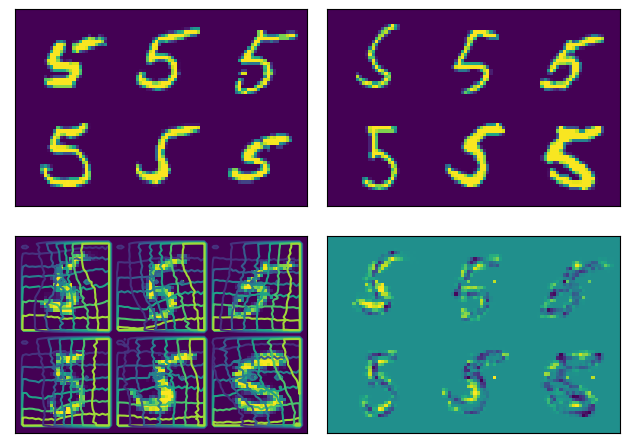
    


```python
ufeatures = unet(image_A)
plt.imshow(ufeatures[0, 60].detach().cpu())
```


    <matplotlib.image.AxesImage at 0x7fe190acd160>


    
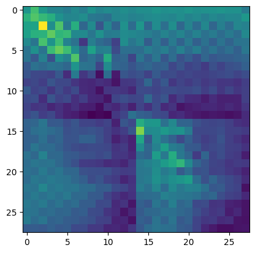
    


```python

```


```python
net.train()
net.to(device)
optim = torch.optim.Adam(net.parameters(), lr=0.0001)
curves = icon.train_datasets(net, optim, ds, ds, epochs=5)
plt.close()
plt.plot(np.array(curves)[:, :3])


```

    100%|███████████████████████████████████████████████████████████████████████████████████████████████████████████████████| 5/5 [00:27<00:00,  5.53s/it]


    [<matplotlib.lines.Line2D at 0x7fe190aa2ca0>,
     <matplotlib.lines.Line2D at 0x7fe190aa2d00>,
     <matplotlib.lines.Line2D at 0x7fe190aa2d30>]


    
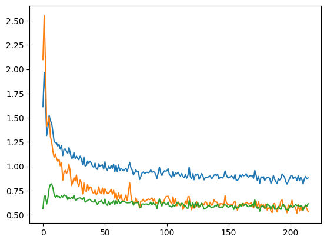
    


```python
curves = icon.train_datasets(net, optim, ds, ds, epochs=50)
plt.close()
plt.plot(np.array(curves)[:, :3])

```

    100%|█████████████████████████████████████████████████████████████████████████████████████████████████████████████████| 50/50 [04:34<00:00,  5.49s/it]


    [<matplotlib.lines.Line2D at 0x7fe19070aa30>,
     <matplotlib.lines.Line2D at 0x7fe190817970>,
     <matplotlib.lines.Line2D at 0x7fe19070aac0>]


    
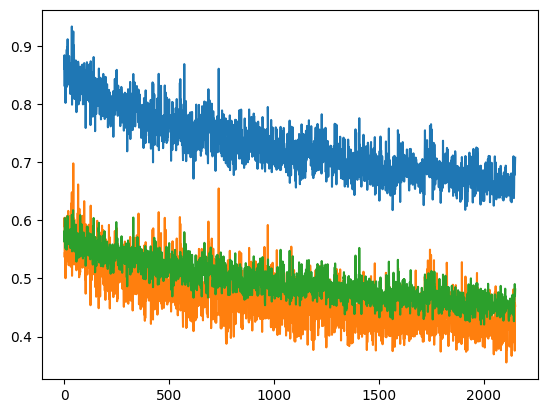
    


```python
def show(tensor):
    plt.imshow(torchvision.utils.make_grid(tensor[:6], nrow=3)[0].cpu().detach())
    plt.xticks([])
    plt.yticks([])
image_A = next(iter(ds))[0].to(device)
image_B = next(iter(ds))[0].to(device)
net(image_A, image_B)
plt.subplot(2, 2, 1)
show(image_A)
plt.subplot(2, 2, 2)
show(image_B)
plt.subplot(2, 2, 3)
show(net.warped_image_A)
plt.contour(torchvision.utils.make_grid(net.phi_AB_vectorfield[:6], nrow=3)[0].cpu().detach())
plt.contour(torchvision.utils.make_grid(net.phi_AB_vectorfield[:6], nrow=3)[1].cpu().detach())
plt.subplot(2, 2, 4)
show(net.warped_image_A - image_B)
plt.tight_layout()
```


    
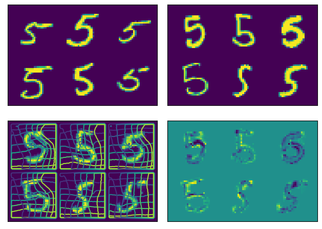
    


```python
ufeatures = unet(image_A)
plt.imshow(ufeatures[0, 9].detach().cpu())
plt.colorbar()
```


    <matplotlib.colorbar.Colorbar at 0x7fe190507bb0>


    
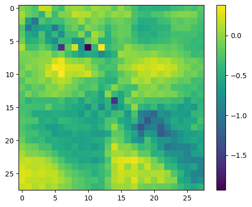
    


```python
plt.imshow(ar.attention.cpu().detach()[0, 190].reshape(28, 28))
```


    <matplotlib.image.AxesImage at 0x7fe190c1bbe0>


    
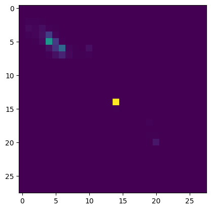
    


```python
plt.imshow(ar.attention.cpu().detach()[0])
```


    <matplotlib.image.AxesImage at 0x7fe190c6b5e0>


    
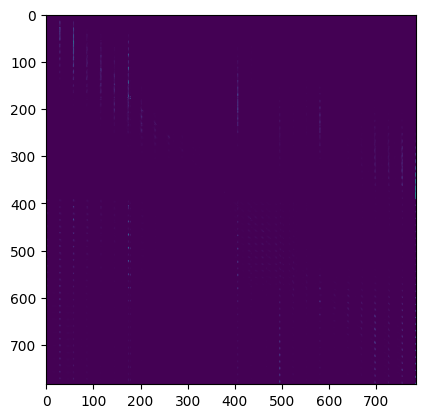
    


```python
w
```
